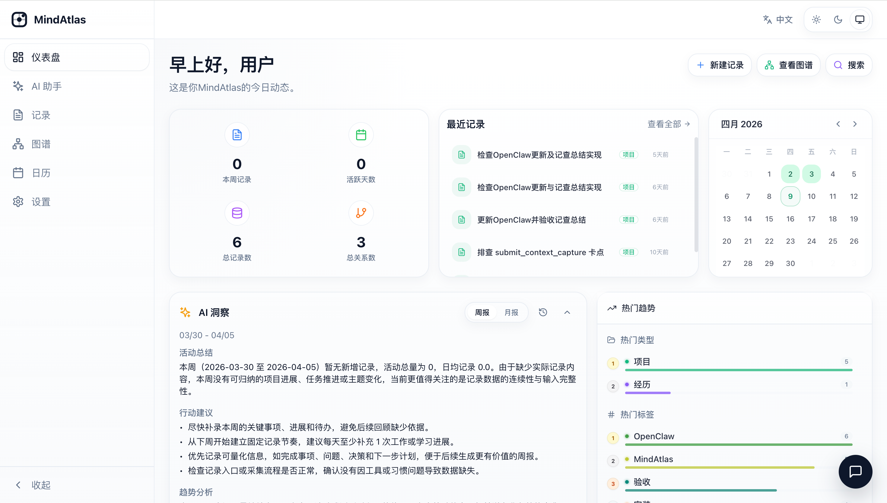
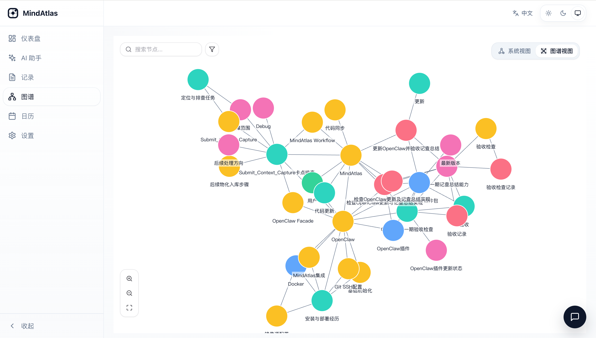
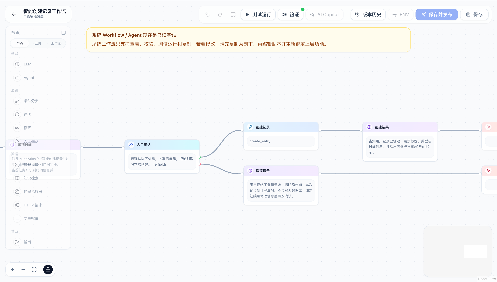

# MindAtlas

Self-hosted knowledge and experience management for capturing, connecting, searching, and reviewing what matters.

[中文文档](README.zh-CN.md)

## Overview

MindAtlas helps turn scattered notes, project records, and life events into a structured personal atlas. The core model is an **Entry** with Markdown content, optional time data, tags, typed relations, attachments, and graph connections.

## Preview

A quick look at the current product experience:

<table>
  <tr>
    <td align="center" colspan="2">
      
      <br />
      <strong>Dashboard</strong>
      <br />
      Overview, activity, calendar, and AI insights.
    </td>
  </tr>
  <tr>
    <td align="center" width="50%">
      
      <br />
      <strong>Knowledge Graph</strong>
      <br />
      Explore connections, clusters, and related records.
    </td>
    <td align="center" width="50%">
      
      <br />
      <strong>Workflow Editor</strong>
      <br />
      Build workflows and agents visually on a canvas.
    </td>
  </tr>
</table>

The current system goes beyond basic note CRUD:

- **Structured knowledge capture** with entry types, tags, relations, attachments, dashboard views, calendar views, and graph exploration
- **First-run initialization** for locale, default entry types, AI provider setup, and runtime capability modules
- **Runtime system setup** for storage, knowledge graph, document parsing, and automation settings after initialization
- **AI registry and assistant configuration** for providers, models, tools, skills, targets, workflows, agents, and system AI behaviors
- **Optional LightRAG knowledge graph** backed by Neo4j for indexing, RAG-style querying, and graph-assisted exploration
- **Docling-based document parsing** for uploaded files, including OCR and optional picture-description support
- **Scheduled AI reports** with weekly and monthly report generation plus dashboard access
- **OpenClaw integration** with a configurable capability catalog and a shipped plugin package in this repository

## Tech Stack

### Backend

- FastAPI
- PostgreSQL + SQLAlchemy
- Alembic
- MinIO (S3-compatible object storage)
- LangChain + OpenAI-compatible APIs
- LightRAG + Neo4j (optional)
- APScheduler for background automation

### Frontend

- React 18 + TypeScript
- Vite
- Zustand + TanStack Query
- Tailwind CSS
- react-i18next

## Project Layout

```text
MindAtlas/
├── backend/                        # FastAPI API, workers, scheduler, runtime config
├── frontend/                       # React app, initialization flow, settings pages, dashboard
├── deploy/                         # Docker Compose deployment and overrides
├── docs/                           # User manuals and supporting docs
└── integrations/openclaw-mindatlas/ # OpenClaw plugin package
```

## Quick Start

### Prerequisites

- Docker 20.10+
- Docker Compose 2.0+
- Python 3.11+
- Node.js 18+
- PostgreSQL 15+
- MinIO or another S3-compatible object store
- Neo4j 5+ if you enable LightRAG

### 1. Clone

```bash
git clone https://github.com/novisfff/MindAtlas
cd MindAtlas
```

### 2. Start with Docker Compose (recommended)

```bash
cd deploy
docker compose up -d
```

Docker deployment is zero-config by default. If you want to override ports, passwords, or other runtime defaults, copy `deploy/.env.example` to `deploy/.env` and edit only the values you need.

Then open:

- App: `http://localhost:3000`
- MinIO Console: `http://localhost:9001`
- Neo4j Browser: `http://localhost:7474`

### 3. Local development setup

#### Backend

```bash
cd backend

python -m venv .venv
source .venv/bin/activate  # Windows: .venv\Scripts\activate

pip install --require-hashes -r requirements/api-worker.lock

cp .env.example .env
# Edit .env for database, storage, and any optional AI / LightRAG settings

alembic upgrade head
uvicorn app.main:app --reload --port 8000
```

The API docs are available at `http://localhost:8000/docs`.

#### Optional workers

If LightRAG is enabled:

```bash
cd backend
source .venv/bin/activate
python -m app.lightrag.worker
```

If you want attachment parsing with Docling:

```bash
cd backend
source .venv/bin/activate
pip install --require-hashes -r requirements/parse-worker.lock
python -m app.attachment.worker
```

See [`backend/README.md`](backend/README.md) for Docling dependency notes and full backend setup details.

#### Frontend

```bash
cd frontend
npm install
npm run dev
```

Open `http://localhost:3000`.

On first run, MindAtlas will guide you through initialization and let you configure runtime modules such as storage, knowledge graph, document parsing, and automation.

## Configuration At A Glance

- Docker deployment uses built-in defaults from [`deploy/docker-compose.yml`](deploy/docker-compose.yml) plus optional overrides from [`deploy/.env.example`](deploy/.env.example).
- Manual development setup reads from [`backend/.env.example`](backend/.env.example).
- Runtime capability settings are managed in `Settings -> System Setup` after initialization.
- Automation settings currently control the background scheduler used for weekly and monthly AI reports.

## Where To Go Next

- [`deploy/README.md`](deploy/README.md): Docker deployment guide
- [`backend/README.md`](backend/README.md): backend setup, workers, and environment details
- [`docs/user-manual.md`](docs/user-manual.md): English user manual
- [`docs/user-manual.zh-CN.md`](docs/user-manual.zh-CN.md): Chinese user manual
- [`integrations/openclaw-mindatlas/README.md`](integrations/openclaw-mindatlas/README.md): OpenClaw plugin package and integration guide

## License

MIT License
