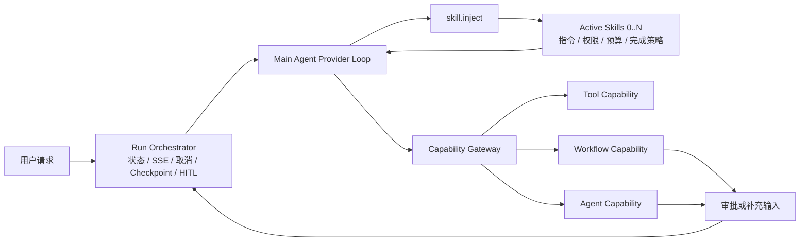
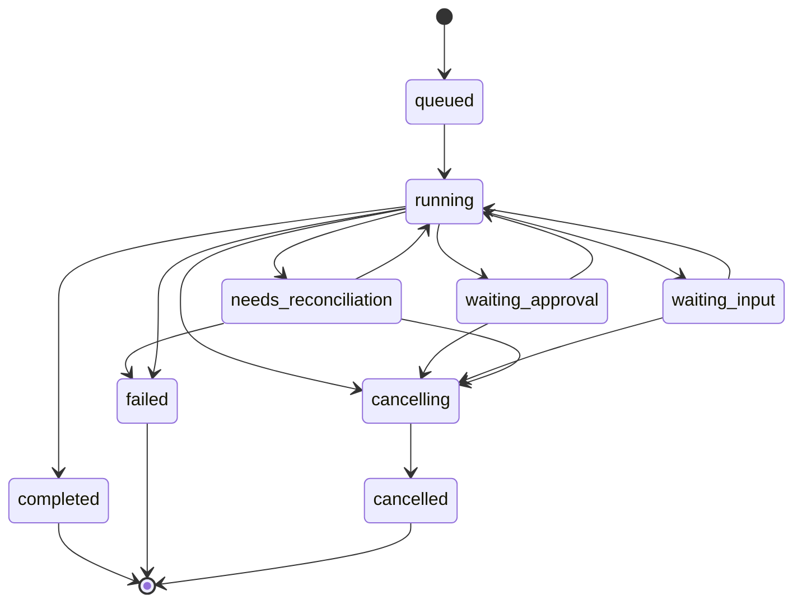

# MindAtlas 通用 Skill 与 Agent Loop 总体改造方案

> 状态：总体设计基线
>
> 日期：2026-07-13
>
> 适用范围：MindAtlas 主 AI 助手、Skill 配置、Tool/Workflow/Agent 能力执行、Run/HITL、管理端与迁移
>
> 实施方式：1 份总设计 Spec + 10 份按顺序落地的 Implementation Plan

## 1. 文档目的

本文档用于固化 MindAtlas AI 功能改造的总体方向，作为后续实施计划、代码评审和迁移验收的共同基线。

它解决两个核心问题：

1. 将当前“路由到一个 Skill，再执行一个 Workflow 或 Agent”的 Skill 机制改造成可组合、可版本化的通用 Skill 机制。
2. 将 Culina 已验证的 Agent Loop 分层思想引入 MindAtlas，但基于 MindAtlas 当前 Provider、LangGraph、SSE、记忆和能力资产重新实现，而不是直接复制 Culina 代码。

本文档只定义目标架构、边界、顺序和验收门槛。具体文件修改、数据库迁移步骤和测试命令由后续 10 份 Implementation Plan 分别描述。

## 2. 当前系统事实

### 2.1 当前 Skill 是单目标路由配置

当前主助手链路是：

```text
用户输入
  -> SkillRouter 单次意图判断
  -> Supervisor 选择一个 Skill
  -> Skill 执行一个 Workflow 或 Agent
  -> 本轮结束
```

相关代码：

- `backend/app/assistant/orchestration/intent_router.py`
- `backend/app/assistant/orchestration/supervisor_graph.py`
- `backend/app/assistant/orchestration/agent_runtime.py`
- `backend/app/assistant_config/models.py`

`AssistantSkill` 当前通过数据库约束只能绑定一个 `workflow_id` 或一个 `agent_profile_id`，不能表达：

- 一个 Skill 同时使用多个 Tool、Workflow 和 Agent。
- 同一任务动态加载多个 Skill。
- Skill 自身的独立版本、指令、资源、权限和预算。
- Skill 只负责指导主 Agent，而不直接成为执行目标。

### 2.2 当前 Agent Loop 的工具集合是固定的

`backend/app/assistant/workflow/engine/agent_execution_core.py` 中的 `run_agent_execution` 在循环开始前调用一次 `bind_tools`，之后所有 round 共用固定工具集合。

当前限制包括：

- 无法在模型调用 `skill.inject` 后为下一 round 动态增加工具。
- 多个工具调用只执行第一个。
- 达到最大迭代次数后直接按 `max_iterations` 结束。
- Provider Loop 的停止原因不足以表达审批、补充输入和业务未完成状态。

### 2.3 MindAtlas 已经具备可复用基础

本次改造不需要推翻现有 AI 能力资产。

可复用部分包括：

- Tool 执行和数据库上下文绑定。
- Workflow DAG、条件、循环和人审节点。
- Agent Profile 和 Published Draft。
- 后台 `AssistantChatRun`、事件日志、SSE 回放和取消。
- L0/L1/L2 记忆。
- OpenClaw 中 Tool、Workflow、Agent 三类 Capability 的执行与 Schema 校验逻辑。

当前 OpenClaw Capability 执行入口位于：

- `backend/app/openclaw_integration/service.py::_execute_tool_capability`
- `backend/app/openclaw_integration/service.py::_execute_workflow_capability`
- `backend/app/openclaw_integration/service.py::_execute_agent_capability`

这些实现应抽取为共享 Capability Runtime，而不是让主助手依赖 OpenClaw 模块。

### 2.4 当前 HITL 不是持久化中断恢复

`backend/app/assistant/workflow/human_approval_runtime.py` 当前通过后台线程轮询等待审批结果。

这种方式能支持现有交互，但不能完整满足新 Agent Loop：

- 服务重启后无法从准确执行点恢复。
- Tool Handler 可能长期阻塞。
- 缺少通用 `waiting_input` Run 状态。
- 恢复幂等和已完成 Capability 去重边界不够明确。

### 2.5 不能直接复制 Culina Runner

MindAtlas 当前依赖 `langgraph==0.3.34`，Culina 当前依赖 `langgraph==1.2.0`，且两边 Provider 实现不同。

因此本次采用以下原则：

- 复用 Culina 的架构分层、状态语义、预算和软收尾思想。
- 不直接复制 Culina 的业务 Skill 字段、Runner 或 Provider 代码。
- 在 MindAtlas 当前依赖和兼容模型上建立明确抽象。
- LangGraph 升级如有必要，必须单独评估，不作为隐含前提。

此外，仓库 `backend/requirements.txt` 锁定 `langgraph==0.3.34`，但当前本地 `.venv` 实际安装的是 `1.0.5`。后续 Provider Loop、Checkpoint 和 HITL 验收必须在干净、锁定、可复现的依赖环境中执行；本地未锁定环境的通过结果不能作为兼容性证据。

## 3. 已锁定的总体决策

以下决策作为后续计划的默认基线，除非有新的产品要求，否则不应在各 Implementation Plan 中反复改变。

### 3.1 Skill 不再是执行目标

新的 Skill 定义为：

> 向主 Agent 注入专业指令、适用边界、Capability 范围、权限、预算、完成策略和资源的可版本化能力包。

Skill 不直接等同于 Tool、Workflow 或 Agent。

### 3.2 Tool、Workflow、Agent 统一为 Capability

三类 Capability 保留各自内部实现，但对上层提供统一描述和执行接口。

```text
Capability
├── ToolCapability
├── WorkflowCapability
└── AgentCapability
```

### 3.3 Main Agent 是主助手唯一编排入口

新的 Main Agent 负责：

- 理解用户请求。
- 发现并注入一个或多个 Skill。
- 在同一 Provider Tool Loop 内连续调用 Capability。
- 汇总最终结果。
- 将审批和补充输入交给外层 Run Orchestrator。

旧 `SkillRouter -> selected Skill` 链路只作为迁移期兼容路径，最终删除。

### 3.4 Workflow DAG 保留

Agent Loop 不替代 Workflow DAG。

- Agent Loop 负责动态决策和能力编排。
- Workflow DAG 负责确定性业务步骤、条件、循环和人审。
- Main Agent 通过 Workflow Capability 调用已发布 Workflow。

### 3.5 Published Version 是生产运行事实来源

生产运行只允许引用已发布版本：

- Published Skill Version。
- Published Workflow Version。
- Published Agent Draft。
- 已冻结 Schema 和实现修订的 Tool Definition。

Draft 只用于管理端编辑和测试，不直接进入生产 Catalog。

生产 Workflow Capability 不得通过 `AssistantWorkflow.graph_snapshot` 读取执行快照，因为该属性当前优先返回 Draft。生产执行必须显式读取 `published_version_id` 对应的不可变 Snapshot；Agent 也必须显式读取 Published Draft。

### 3.6 每个 Run 冻结不可变解析结果

Run 启动时必须生成基础 `ResolvedRunManifestRevision`；每次动态激活 Skill 时，基于上一版追加一个新的不可变 Revision。已有解析项永不被覆盖，Checkpoint 总是引用明确的 `manifest_revision`。每个 Revision 至少冻结：

- Main Agent Profile Version 和 Prompt Digest。
- Skill Version ID、标准名称、内容 Digest 和资源索引 Digest。
- Capability Key、Type、Version、Schema Digest 和 Provider Alias。
- Workflow Published Version ID。
- Agent Published Draft ID。
- Tool Schema、配置摘要和实现 Revision。
- Effective Policy 与授权来源。
- Provider、Model ID 和关键兼容特征。

这是一条 append-only 版本链，不是运行中原地修改的 JSON。新 Skill 可以向下一 Revision 增加冻结绑定，但不能替换先前已经执行过的 Skill、Capability 或 Alias。Checkpoint 和恢复必须读取对应 Revision，不得只保存 Skill Key 后重新解析“当前最新版本”。等待审批期间发生的新发布只影响后续新 Run，不影响已经启动的 Run。

### 3.7 对齐 Agent Skills 标准层

MindAtlas 通用 Skill 的可移植标准层应遵循 [Agent Skills 规范](https://agentskills.io/specification)：

```text
skill-name/
├── SKILL.md
├── scripts/
├── references/
└── assets/
```

其中：

- 根目录必须包含带 YAML frontmatter 的 `SKILL.md`。
- `name` 和 `description` 是标准必填字段。
- `name` 长度为 1～64，只使用小写字母、数字和连字符，不以连字符开头或结尾、不包含连续连字符，且与目录名一致。
- `description` 长度为 1～1024，并同时说明能力内容和适用时机。
- 标准可选字段 `license`、`compatibility`、`metadata` 和实验性的 `allowed-tools` 应可校验并无损导入导出；`allowed-tools` 只作为兼容提示，不能覆盖 MindAtlas Gateway 的后端授权。
- 完整 `SKILL.md` 只在 Skill 激活后加载。
- `references/` 和 `assets/` 按需读取。
- `scripts/` 是否可执行由宿主实现决定。

MindAtlas 专有运行字段不伪装成 Agent Skills 标准字段，而是放入扩展层：

```text
mindatlas.yaml
  capability bindings
  side-effect policy
  budget
  completion policy
  published version metadata
  provider aliases
```

现有业务 Skill 的下划线名称如 `quick_stats`、`smart_capture` 迁移为 `quick-stats`、`smart-capture`，同时保留 Legacy Alias，兼容历史消息、L2 记忆、事件和旧配置。`general_chat` 不再发布为新 Skill，而是迁入 Main Agent 基础行为；其旧名称只保留在 Legacy Adapter 和历史数据解析中。

第一阶段导入的 `scripts/` 只作为不可执行资源保存。未来若开放执行，必须单独设计沙箱、依赖白名单、超时、包大小、哈希、路径穿越、符号链接和压缩炸弹防护。

### 3.8 Skill 的运行时来源以数据库版本为准

推荐形式：

- 数据库 Published Version 是运行时事实来源。
- 支持导入导出标准 Skill 目录和可选 `mindatlas.yaml` 扩展。
- 系统内置 Skill 可以由代码资产初始化或同步到数据库。
- 不要求生产运行时直接扫描本地文件目录。

### 3.9 第一条新架构黄金路径必须是只读路径

在持久化 HITL 和完整权限策略完成前，新 Main Agent 只开放只读或纯计算 Capability，但 Plan 02 必须先提供最小 deny-by-default Policy；只读能力也可能泄露敏感信息，不能依赖“只读即安全”的假设。

写入型 Capability 必须等权限、副作用、审批和幂等机制就绪后再开放。

Plan 04 必须先建立 Legacy Router 对照数据集和评测工具，再迁移只读黄金路径；Main Agent 可运行后立即进行同集对比。至少评估 Skill 注入准确率、误注入率、Capability 成功率、轮数、Token、延迟和 Completion Contract。评测不是 Plan 10 才开始的上线收尾工作。

## 4. 目标架构



### 4.1 三层 Loop 必须分离

| 层次 | 责任 | 不负责 |
|---|---|---|
| Provider Tool Loop | 模型 round、动态工具、工具结果回填、自然收尾 | 持久化审批、业务完整性 |
| Run Orchestrator | Run 状态、Checkpoint、取消、审批、补充输入、恢复 | 具体 Workflow 业务步骤 |
| Workflow DAG | 确定性步骤、条件、循环、人审节点 | 主助手的通用 Skill 发现 |

Provider 的“没有继续调用工具”只表示模型回合结束，不自动证明业务任务有效完成。业务完成条件由 Capability Contract 和 Orchestrator Completion Policy 判断。

### 4.2 Main Agent Profile 是独立、可版本化契约

Main Agent 不能只是一段散落在代码中的 Prompt。它需要独立的 Published Profile，至少包含：

- Profile Version 和内容 Digest。
- 基础 Prompt。
- 默认响应风格。
- 支持的入口和模型能力要求。
- 基础控制 Capability。
- Skill Catalog Scope。
- 上下文和输出预算。
- 全局安全与回退策略。

无需专业 Skill 的问候、闲聊、通用问答和简单文本任务由 Main Agent 直接回答。现有 `general_chat` 应迁移为 Main Agent 基础行为，而不是每轮注入的业务 Skill。

### 4.3 Prompt Builder 与上下文优先级

运行时由统一 Prompt Builder 构造受控上下文层，推荐优先级：

1. 平台安全和不可覆盖规则。
2. Published Main Agent Profile。
3. 入口、用户和 Effective Policy。
4. Active Skill Published Instructions。
5. Run Manifest、任务状态和 Pending Obligations。
6. L1/L2 记忆摘要和按需读取的历史。
7. 当前用户消息。
8. Tool/Capability Result。

`skill.inject` 的 Tool Result 只返回激活结果、版本引用和资源索引；下一 round 的完整 Active Skill 指令由 Prompt Builder 放入受控高优先级层，不能只依赖普通 Tool Result 承载指令。

Prompt Builder 还必须定义：

- 每层字符或 Token 预算。
- 超限时的压缩和丢弃顺序。
- 大型 Tool Result 的摘要与 Artifact 化。
- 何时通过 `skill.read_resource` 或 `artifact.read` 重读完整内容。
- 防止用户内容、Skill 资源和 Tool Result 越级覆盖系统规则的边界。

### 4.4 Main Agent 模型兼容性

进入 Main Agent Catalog 的 Provider/Model 至少要经过以下能力探测或兼容测试：

- Function/Tool Calling。
- 流式文本与流式 Tool Call。
- JSON Schema 兼容程度。
- 多 Tool Call 行为。
- Tool Call ID 稳定性。
- 结构化输出和错误行为。

不满足要求的模型不能静默进入完整 Agent Loop，应降级到明确的受限模式或被拒绝。

## 5. 核心领域契约

具体类型名可在 Plan 01 中调整，但语义必须保持稳定。

### 5.1 SkillPackage

标准 Skill 包目录：

```text
weekly-review/
├── SKILL.md
├── mindatlas.yaml
├── references/
├── assets/
└── scripts/
```

`SKILL.md` 只包含标准 frontmatter 和指令正文：

```markdown
---
name: weekly-review
description: 汇总和分析一周内的 MindAtlas 记录；适用于周报、回顾和阶段总结。
---

# Weekly review

这里是激活后加载的 Skill 指令。
```

`mindatlas.yaml` 包含宿主扩展：

```yaml
version: 1
display_name: 周度回顾
legacy_aliases:
  - weekly_review

routing:
  include_examples: []
  exclude_examples: []
  conflict_rules: []

capabilities:
  - type: tool
    key: search_entries
  - type: workflow
    key: weekly_summary
  - type: agent
    key: writing_assistant

policy:
  allowed_side_effects:
    - read
    - compute
  max_skill_calls: 16
  max_same_read_calls: 3
  requires_terminal_output: true
  terminal_text_allowed: true
```

数据库 Published Skill Version 保存标准文件内容、扩展 Manifest、资源索引、内容 Digest 和导入来源；运行时不依赖磁盘目录持续存在。

### 5.2 CapabilityDescriptor

至少包含：

- `key`
- `type`
- `display_name`
- `description`
- `input_schema`
- `output_schema`
- `side_effect`
- `availability`
- `published_version_ref`
- `schema_digest`
- `executable_revision`
- `provider_alias`
- `parallel_safe`
- `timeout_policy`
- `completion_metadata`

### 5.3 CapabilityResult

统一结果需要支持：

- 用户可见文本。
- 结构化输出。
- Artifact 引用。
- Draft 或审批请求。
- 补充输入请求。
- Continuation 状态。
- 标准化错误。
- 是否需要继续调用。
- 是否构成终态输出。

### 5.4 AgentLoopResult

建议状态：

- `completed`
- `waiting_approval`
- `waiting_input`
- `needs_reconciliation`
- `failed`
- `cancelled`

同时记录：

- 最终文本。
- Tool/Capability 调用记录。
- Active Skills。
- 停止原因。
- 预算使用量。
- Artifacts。
- Pending Interrupt。

### 5.5 ResolvedRunManifestRevision

`ResolvedRunManifestRevision` 是 Run 的不可变解析快照。基础 Revision 在 Run 启动时创建；Skill 动态注入时生成只追加、不覆盖旧绑定的下一 Revision。它不能只保存易漂移的业务 Key，必须保存实际执行版本、Digest、Provider Alias、Effective Policy 和模型配置。

每个 Agent Round、CapabilityCall 和 Checkpoint 都记录使用的 `manifest_revision`。恢复、重试、审计和结果解释以对应 Revision 为准；新发布版本不会回写或替换已启动 Run 的任何 Revision。

### 5.6 CapabilityCall

每次 Capability 调用都需要独立 Ledger 记录，至少包含：

- `run_id`
- `manifest_revision`
- `provider_tool_call_id`
- `capability_version_ref`
- `owner_skill_version_id`
- `input_digest`
- `idempotency_key`
- `status`
- `attempt`
- `side_effect_started`
- `output` 或 Artifact 引用
- `interrupt`
- `error`

建议状态至少包括：

- `pending`
- `running`
- `deferred`
- `blocked`
- `waiting_approval`
- `waiting_input`
- `completed`
- `failed`
- `cancelled`
- `unknown`
- `needs_reconciliation`

数据库唯一约束用于阻止双 Worker、重复审批和重复 Resume 造成的重复执行。

### 5.7 副作用分类

统一使用：

- `read`：只读取数据。
- `compute`：纯计算或转换，不持久化业务数据。
- `draft`：生成待确认草稿。
- `write`：正式持久化业务变更。
- `control`：Skill 注入、请求补充输入等运行控制能力。

副作用不能只写在 Prompt 中，必须由 Gateway 强制校验。

## 6. 通用 Skill 运行机制

### 6.1 初始工具面

Main Agent 默认只暴露少量基础控制能力，例如：

- Domain Key `skill.inject`，Provider Alias `skill_inject`。
- Domain Key `human.request_input`，Provider Alias `human_request_input`。
- 必要的全局只读能力

业务 Capability 默认不可见。

Domain Key 是内部稳定标识，Provider Alias 是发送给模型的协议名称。两者必须一对一映射并可反向解析，不能假设所有 Provider 都接受点号、任意长度或相同字符集。

### 6.2 Skill 发现

Main Agent 获取紧凑的 Skill Catalog Record，只包含选择 Skill 所需信息：

- Skill key。
- 显示名。
- 描述。
- include/exclude 示例摘要。
- 是否可用。

完整指令和 Capability 列表只在 Skill 注入后提供，避免初始上下文无限增长。

当 Published Skill 数量超过直接 Catalog 的上下文预算时，采用分级发现：

1. 基于描述、入口和历史做 Top-K Catalog Recall。
2. Main Agent 可调用 `skill.search` 扩大或分页发现范围。
3. 激活后才读取完整 `SKILL.md`。
4. 通过 `skill.read_resource` 按需读取 `references/` 和 `assets/`。

Catalog Recall 只能缩小候选集，不能绕过入口、用户和全局授权。

### 6.3 skill.inject

`skill.inject` 必须：

1. 校验请求格式。
2. 校验 Skill 是否已发布且当前入口可用。
3. 去重。
4. 检查最大 Skill 数量。
5. 解析 Published Skill Version，并生成下一份不可变 `ResolvedRunManifestRevision`。
6. 更新 Active Skill Version References。
7. 返回 Skill Version、内容 Digest、资源索引和激活结果。
8. 重新计算可见 Capability。
9. 重新计算预算和完成策略。
10. 记录注入事件并发送 SSE。

支持一次注入一个或多个 Skill。

Skill 激活后，Prompt Builder 在下一 round 从冻结的 Skill Version 构建 Active Skill 指令层；不能重新读取“当前最新版本”。

### 6.4 多 Skill 授权、预算和完成义务

Capability 授权必须保留来源，不使用“所有 Active Skill 全局取最严”或“任一 Skill 放宽全部能力”的粗粒度规则。

某次 Capability 调用只有同时满足以下条件才允许：

```text
该 Capability 被至少一个 Active Skill Version 声明
AND 调用归属到一个明确的 Owner Skill Version
AND 满足该 Owner Skill 的 Capability 与副作用 Policy
AND 满足入口、Principal 和全局 Policy
AND Capability 当前版本可用
```

因此：

- 只读 Skill 不会无条件阻止另一个独立 Skill 已声明的写能力。
- 宽松 Skill 也不能放宽其他 Skill 的 Capability。
- 多个 Skill 都声明同一 Capability 时，调用前必须确定 Owner 或满足所有共同 Owner 的显式规则。
- 每个 CapabilityCall 记录 Owner Skill Version 和授权证据。

预算采用双重扣减：

- Run 总预算是固定硬上限，注入更多 Skill 不增加 Run 总预算。
- 每次调用同时扣除 Run 总预算和 Owner Skill 预算。
- 相同读取限制按 Capability Signature 和 Owner 记录。
- 控制工具是否计入预算必须显式声明，不能依赖名称特例。

完成策略使用 `Obligation Ledger`，记录：

- 哪个 Skill/Capability 产生了强制 Follow-up。
- 哪个审批或补充输入尚未完成。
- 哪个终态输出尚未生成。
- 哪个义务已经由哪个 CapabilityCall 或最终文本满足。

Run 只有在所有阻塞性 Obligation 已满足或被明确取消后才能完成。冲突规则由 Skill Manifest 显式声明，不能依赖注入顺序。

## 7. Capability Runtime

### 7.1 统一接口

共享 Capability Runtime 至少提供：

- Catalog/Registry 查询。
- 可用性判断。
- Published Version 解析。
- 输入 Schema 校验。
- 权限和副作用校验。
- 执行。
- 输出 Schema 校验。
- 结果标准化。
- 超时和取消。
- 事件和审计。

Plan 02 就必须实现最小 deny-by-default Policy 和 Principal/入口校验，Plan 05 再补齐多 Skill 来源授权、分层预算和 Obligation Ledger。Plan 04 的只读黄金路径不能绕过最小权限层。

### 7.2 Tool Capability

- 复用当前 Tool Registry 和 DB Context 包装。
- 为每个 Tool 补齐副作用和完成元数据。
- 冻结输入输出 Schema Digest、配置摘要和实现 Revision。
- 禁止通过 Skill 暴露未声明 Tool。

Tool 的 `executable_revision` 必须能定位到实际部署实现，例如构建产物 Digest、镜像 Digest 或由 Tool Registry 管理的不可变 Handler Revision，不能只写一个人工可改的版本字符串。恢复 Worker 如果无法提供 Manifest 指定的实现 Revision，应停止并报告兼容性错误，不能静默使用当前代码重跑写调用。

### 7.3 Workflow Capability

- 只执行已发布 Workflow Version。
- 显式读取 `published_version_id` 对应 Snapshot，不使用优先 Draft 的 `graph_snapshot` 属性。
- 使用结构化输入和输出 Contract。
- Workflow 内节点事件作为 Capability 子事件发送。
- 人审节点不得无限阻塞 Provider Loop，最终迁移为 Run Interrupt。

### 7.4 Agent Capability

- 只执行已发布 Agent Draft。
- 默认使用 fixed capabilities 或 disabled skill injection。
- 必须限制嵌套深度和递归。
- Agent Capability 不能无条件重新启动 Main Agent。

## 8. Provider Agent Loop

目标接口应支持动态工具提供器，而不是固定工具列表：

```python
generate_with_tools(
    messages=messages,
    tools_provider=tools_provider,
    tool_dispatcher=tool_dispatcher,
    max_rounds=max_rounds,
)
```

每个 Provider Round：

1. 检查取消。
2. 调用 `tools_provider()` 获取当前工具。
3. 绑定本轮工具。
4. 流式请求模型。
5. 无工具调用时返回自然语言结果。
6. 有工具调用时依次或按明确策略执行。
7. 将 Assistant Tool Call 和 Tool Result 写回消息。
8. 进入下一 round。

### 8.1 Provider 名称映射

Provider Adapter 负责将内部 Domain Key 映射为符合当前 Provider 协议的 Alias，并将 Tool Call 反向解析为唯一 Domain Key：

```text
skill.inject          <-> skill_inject
human.request_input   <-> human_request_input
entry.search          <-> entry_search
```

映射表属于对应的 `ResolvedRunManifestRevision`，同一 Run 恢复时不得重新生成。发布或激活前必须检查：

- Alias 满足当前 Provider 的字符、长度和保留字限制。
- 归一化后无名称冲突。
- Alias 与 Domain Key 一一对应且可逆。
- Tool Result、事件和审计始终同时保留 Provider Alias 与 Domain Key。

Domain Key 不因为更换 Provider 而变化；Provider Alias 也不能成为权限、预算或幂等判断的业务主键。

### 8.2 同一 Assistant Message 的多 Tool Call

Provider 返回多个 Tool Call 时，不能只执行第一个。该 Assistant Message 中每个 Tool Call 都必须得到一个与协议匹配的 Tool Result；未执行的调用也必须返回明确的 `deferred`、`cancelled` 或 `blocked` 结果，不能静默丢弃。

默认调度规则：

1. `read`、`compute` 且 Capability 标记 `parallel_safe=true` 时，才允许受限并行。
2. `draft`、`write`、`control` 和未明确标记并行安全的调用按原顺序串行执行。
3. 每个调用执行前都重新检查 Owner Skill、Effective Policy、预算、取消状态和前序调用产生的新 Obligation。
4. 某个调用产生审批或补充输入时，当前 Run 进入等待状态；尚未开始的兄弟调用记录为 `deferred`，恢复后由 Orchestrator 根据原 Tool Call ID 和最新前置条件决定继续或取消。
5. 某个写调用的外部结果不确定时，停止调度后续有副作用调用，进入 `needs_reconciliation`，不得自动重试。
6. 工具结果回填顺序保持与原 Tool Call 顺序一致，避免 Provider 消息协议和可重放记录漂移。

### 8.3 软收尾

Provider 达到最大轮次时：

1. 最后一轮不再暴露工具。
2. 注入内部收尾提示。
3. 要求模型基于已有结果自然总结。
4. 说明已完成和未完成部分。
5. 模型仍请求工具时才硬停止。

软收尾逻辑属于 Provider Loop，因为只有 Provider Loop 持有完整中间消息状态。

## 9. 权限、预算和完成策略

### 9.1 最终权限计算

```text
入口允许范围
∩ 当前用户权限
∩ 调用 Owner Skill Version 的 Capability 与副作用声明
∩ Capability 当前可用状态
∩ 全局安全策略
= 本 round 可见 Capability
```

“本 round 可见”只表示模型可以请求，不代表调用时自动获准。Gateway 必须在每个 CapabilityCall 执行前用冻结版本和授权来源再次判定；多个 Active Skill 的权限既不能简单合并放大，也不能用无关 Skill 的限制全局收紧。

### 9.2 分层预算

至少区分：

- 最大 Provider Round。
- 最大外层 Agent Round。
- 最大 Active Skill 数量。
- 单 Run 最大 Capability 调用数。
- 每个 Owner Skill 的硬调用预算。
- 相同读取调用次数。
- Capability 嵌套深度。
- Agent 递归深度。

不同预算不能混成一个字段，也不能把 Provider Round 当成 Tool Call 数量。

Run 总预算在启动时冻结，Skill 注入只分配或收紧 Skill 局部额度，不增加 Run 总额度。每次 Capability 调用同时消耗 Run 总预算和 Owner Skill 预算。

### 9.3 预算耗尽策略

1. 第一次耗尽时返回模型可读的错误和总结提示。
2. 允许一次无工具的软收尾。
3. 模型继续要求工具时硬停止。

### 9.4 完成契约

Capability 可声明：

- `requires_followup`
- `terminal_output`
- `followup_hint`

Skill 可声明：

- `requires_terminal_output`
- `terminal_text_allowed`

Provider 返回无 Tool Call 不等于业务完成。Orchestrator 必须基于以上 Contract 判断是否允许完成。

## 10. Run Orchestrator、HITL 与恢复

### 10.1 Run 状态

目标状态机：



### 10.2 Checkpoint 内容

至少持久化：

- `ResolvedRunManifestRevision`，包括 Skill/Capability/Main Agent/模型的实际版本和 Digest。
- Active Skill Version IDs、Legacy Alias 解析结果和 Skill 注入历史。
- Provider 消息或可重建消息记录。
- CapabilityCall Ledger 和 Pending Obligation Ledger。
- 预算使用量。
- Pending Approval/Input。
- Artifacts。
- Agent Round。
- 恢复幂等键。

Checkpoint 不得只保存业务 Key 后在恢复时重新查“当前最新发布版本”。

### 10.3 可持久化状态与进程内对象分离

持久化 State 只能包含可验证、可序列化、可迁移的数据，例如标量、结构化消息、版本引用、Digest、Artifact 引用和 Interrupt Payload。

以下对象属于进程内 Runtime Context，不能直接写入 Checkpoint：

- Provider Client、数据库 Session 和事务对象。
- Callback、闭包、锁、线程、事件循环对象。
- `ChatOpenAI` 等 LLM 实例。
- `HumanLoopRuntime` 等轮询或等待对象。

当前 Workflow 执行链会通过 `WorkflowState.metadata` 注入 `HumanLoopRuntime` 和回调，并在 `node_llms` 保存 LLM 实例，因此 Plan 07 必须先定义 `DurableWorkflowState` 与 `EphemeralWorkflowContext` 的边界，再接入持久化 Checkpointer；不能直接序列化现有 `WorkflowState`。

### 10.4 Worker Lease 与恢复扫描

后台执行不能只依赖进程内 daemon thread。持久化 Run Worker 至少需要：

- `lease_owner`、`lease_expires_at` 和可续租心跳。
- Run `revision` 或等价的 compare-and-swap 条件更新。
- 同一 Run 同时最多一个有效执行者。
- 启动和定时扫描 `queued`、过期 `running`、`waiting_*` 和 `needs_reconciliation` Run。
- Worker 崩溃后只接管未完成且允许恢复的步骤。
- SSE 事件使用数据库序号或等价游标保证可回放顺序。

Lease 只解决 Worker 所有权，不替代 Capability 幂等、外部系统幂等键和审批唯一约束。

### 10.5 恢复与不确定副作用要求

- 同一审批只能应用一次。
- 重复提交不能重复写入。
- 已成功 Capability 不得在恢复后无条件重跑。
- 服务重启后可以恢复 waiting 状态。
- SSE 断开只代表订阅者断开，不自动取消后台 Run。
- 取消必须传播到 Provider、Capability、Workflow 和等待状态。

对外部副作用必须区分：

- `side_effect_started=false`：可按重试策略安全重试。
- 外部系统确认成功：记录 `completed`，恢复时复用结果。
- 明确失败且无副作用：记录 `failed`，可按策略重试。
- 请求已发出但无法确认结果：记录 `unknown` 并将 Run 置为 `needs_reconciliation`。

`unknown` 不得自动当作失败重试。必须通过外部幂等键查询、对账 Capability 或人工处理确认结果后，才能转为 `completed`、`failed` 或允许补偿。

## 11. 记忆、上下文和可观测性

### 11.1 记忆边界

- L0：最近原始对话。
- L1：会话摘要。
- L2：长期 Skill/Workflow 事实。
- Active Skill 指令：独立运行时上下文，不写入长期记忆。
- 大型 Capability 输出：保存摘要和 Artifact 引用，按需读取完整内容。

等待、失败和取消状态不得提前写入最终长期记忆。

当前 L2 使用 `conversation_id + skill_name` 作为边界，新机制不能继续把可改名的展示名称或 Provider Alias 当作稳定主键。迁移后至少使用：

```text
conversation_id + stable_skill_id + memory_namespace
```

同时在事实元数据中记录产生该事实的 Skill Version、CapabilityCall 和时间。Legacy Alias 只用于迁移解析，不能生成新的并行记忆命名空间。

只有已声明 `memory.write` 权限的 Capability 或受控的 Run Finalizer 可以写入 L2；Skill 指令、未经确认的模型推断、等待中的草稿和 Tool 原始输出不能直接成为长期事实。Skill 升级时必须定义旧版本事实是继承、迁移、隔离还是失效。

### 11.2 事件层级

```text
run
├── agent_round
├── skill_injection
├── capability_call
│   ├── workflow_node
│   ├── tool_call
│   └── human_interrupt
└── final_output
```

用户可见事件和内部诊断事件必须分离。

### 11.3 可观测字段

至少记录：

- Provider 和模型。
- Round。
- Active Skills。
- 本轮可见 Capability。
- Skill 注入原因。
- Capability 输入输出摘要。
- 预算使用量。
- 停止原因。
- 错误码。
- Token usage 和耗时。

敏感输入、凭据和受保护内容必须脱敏。

## 12. Skill 管理端目标

新的 Skill 管理端不再强制选择一个 `target_type`。

建议分区：

1. 基础信息。
2. 适用场景和排除场景。
3. Skill 指令编辑器。
4. Capability 多选和排序。
5. 权限和副作用。
6. 预算。
7. 完成策略。
8. 资源文件。
9. Draft/Published 和版本历史。
10. 测试工作台。

测试工作台至少展示：

- 为什么注入某个 Skill。
- 当前 Active Skills。
- 当前可见 Capability。
- 每轮 Tool/Capability 调用。
- 预算剩余。
- 停止原因。

测试运行不得污染正式对话和长期记忆。

Skill 包导入和资源读取必须经过统一校验：标准 frontmatter、目录名、扩展 Manifest Schema、资源大小与数量、内容 Digest、MIME、路径穿越、绝对路径、符号链接和压缩炸弹。第一阶段 `scripts/` 只能预览和作为上下文资源读取，管理端不得提供“试运行脚本”入口。

测试工作台分为两类：

- 单 Skill/Capability 交互测试，用于开发者调试。
- 固定数据集离线评测，用于比较 Legacy 与新 Runtime 的注入、误注入、任务成功率、Completion Contract、轮数、Token、延迟和副作用拦截。

发布门禁使用固定评测版本和阈值，不以单次人工对话成功代替回归证据。

## 13. 兼容与迁移策略

### 13.1 迁移期双路径

迁移期间保留：

- Legacy `SkillRouter`。
- Legacy Supervisor 单 Skill 路径。
- Legacy `AssistantSkill` 目标绑定。

新增：

- 新 SkillPackage/SkillVersion。
- Legacy Adapter。
- 新 Main Agent Feature Flag。

### 13.2 迁移顺序

1. 新模型和兼容读取上线。
2. Capability Runtime 抽取上线。
3. Provider Agent Loop 在独立测试入口上线。
4. 新 Main Agent 在 Feature Flag 后上线。
5. 迁移一个只读黄金路径。
6. 完成权限和持久化 HITL。
7. 迁移一个写入/HITL 黄金路径。
8. 逐个迁移全部内置 Skill。
9. 全量启用新运行时。
10. 删除 Legacy Adapter、旧 Router 和单目标约束。

### 13.3 回退要求

在最终清理前：

- 新旧运行时可通过配置切换。
- 新数据结构不得破坏旧 Skill 读取。
- 数据迁移必须有回滚或可重放策略。
- 新 Main Agent 只有在尚未创建 Draft、发起外部请求或执行任何业务副作用前，才可以按明确规则自动回退旧链路。
- 一旦任一 CapabilityCall 进入 `side_effect_started=true`，后续失败必须留在当前 Run 内恢复、补偿或对账，禁止切到旧链路重做任务。
- `unknown` 或 `needs_reconciliation` 状态禁止自动回退。
- 回退原因、原 Runtime、目标 Runtime 和是否发生过副作用必须进入事件与审计。

## 14. 十份 Implementation Plan

每份计划原则上对应一个主要 PR，必须独立可验收、可合并、可回退。Plan 编号同时表示语义依赖顺序；后续 Plan 只能基于已合并的前置契约编写，避免多个方案各自发明不同的数据结构。

### Plan 01：Agent Skills 契约与不可变版本模型

建议文件：

`docs/superpowers/plans/2026-07-13-agent-skills-contracts-and-versioning.md`

范围：

- Agent Skills 标准目录、`SKILL.md` 与 `mindatlas.yaml` 扩展 Schema。
- SkillPackage、SkillVersion、Capability Binding、Main Agent Profile Version。
- `ResolvedRunManifestRevision` 版本链、领域状态枚举和 Digest 规则。
- Draft/Published、Legacy Alias 和下划线名称迁移。
- Workflow/Agent/Tool Published Version 解析契约。
- Skill 包安全校验、数据迁移和回滚测试。

退出条件：

- 新 Skill 包可导入、保存、发布、导出和按不可变版本读取。
- Run Manifest 能冻结所有执行引用，生产 Workflow 不读取 Draft-first Snapshot。
- 旧 Skill 行为不变，主助手运行时尚未切换。

### Plan 02：共享 Capability Runtime 与最小权限层

建议文件：

`docs/superpowers/plans/2026-07-13-shared-capability-runtime.md`

范围：

- Capability Registry、Descriptor、Executor 和 Result。
- Tool/Workflow/Agent Adapter。
- Domain Key 与 Provider Alias 映射基础。
- Schema、版本、超时、取消和错误标准化。
- 最小 deny-by-default Policy、Principal/入口校验和副作用分类。
- 从 OpenClaw 抽取执行逻辑，并让 OpenClaw 改用共享 Runtime。

退出条件：

- 三类 Capability 使用统一接口和冻结版本执行。
- 未显式授权的 Capability 无法执行。
- OpenClaw 行为保持兼容，主助手仍未切换。

### Plan 03：Provider Agent Loop

建议文件：

`docs/superpowers/plans/2026-07-13-provider-agent-loop-runtime.md`

范围：

- 动态 `tools_provider()` 和统一 `tool_dispatcher`。
- 多 round、工具结果回填和流式输出。
- Provider Alias 校验、冲突检查和反向解析。
- 同一 Assistant Message 的多 Tool Call 调度与兄弟调用语义。
- 软收尾、停止原因、取消和模型兼容测试。
- 在干净且锁定的依赖环境中验证 LangGraph/Provider 组合。

退出条件：

- 动态增加的工具可在下一 round 使用。
- 每个 Tool Call 都有匹配结果，写调用不会被错误并行。
- 旧 Agent 行为通过兼容测试，Provider Loop 不依赖业务 Skill。

### Plan 04：Main Agent、Prompt 分层与只读 Skill 闭环

建议文件：

`docs/superpowers/plans/2026-07-13-main-agent-skill-injection.md`

范围：

- Published Main Agent Profile 和统一 Prompt Builder。
- Skill Catalog Recall、`skill.search`、`skill.inject`、`skill.read_resource`。
- Active Skill 指令层、上下文预算和 Artifact 读取。
- 多 Skill 注入、动态 Capability 面和 Skill SSE。
- Legacy Router 对照离线评测和固定评测数据集。
- 新旧运行时 Feature Flag 与一个只读黄金路径。

退出条件：

- 无需独立 Router 模型即可注入一个或多个 Skill。
- 未注入 Skill 的业务 Capability 不可见。
- Skill 资源按需加载且不能覆盖更高优先级规则。
- 只读黄金路径达到预设评测阈值，且可在无副作用阶段回退旧主助手。

### Plan 05：来源授权、预算与完成义务

建议文件：

`docs/superpowers/plans/2026-07-13-agent-loop-policy-and-guardrails.md`

范围：

- CapabilityCall Owner Skill Version 和授权证据。
- 入口、Principal、全局与 Skill Policy 的逐调用判定。
- 固定 Run 总预算、Owner Skill 预算、Round、递归和重复读取预算。
- Obligation Ledger、Completion Contract、软收尾和硬停止。
- Agent Capability 嵌套与递归限制。

退出条件：

- 多 Skill 不会互相放大或错误收紧无关能力。
- 注入 Skill 不会增加 Run 总预算。
- 中间结果和未完成义务不会被错误标记为完成。
- 本阶段仍只开放只读或纯计算 Capability。

### Plan 06：持久化 Run 基础设施

建议文件：

`docs/superpowers/plans/2026-07-13-durable-agent-run-foundation.md`

范围：

- Durable Run State、Checkpoint Schema 和版本迁移。
- `ResolvedRunManifestRevision`、Provider 消息、预算、Obligation 和 Artifact 持久化。
- Worker Lease、心跳、CAS Revision、接管与恢复扫描。
- SSE 数据库序号、回放、取消传播和嵌套事件。
- L0/L1/L2 写入时机与稳定 Skill ID 迁移基础。

退出条件：

- 服务重启后 Run 可由唯一 Worker 从一致 Checkpoint 接管。
- SSE 断开不取消 Run，重连能按游标回放。
- Checkpoint 不包含 Callback、LLM Client、Session 或其他进程内对象。
- 本阶段不开放写入 Capability。

### Plan 07：持久化 Workflow Interrupt 与 Resume

建议文件：

`docs/superpowers/plans/2026-07-13-durable-workflow-interrupt-resume.md`

范围：

- `DurableWorkflowState` 与 `EphemeralWorkflowContext` 分离。
- 将现有阻塞轮询 HITL 迁移为 `waiting_approval`、`waiting_input` Interrupt。
- 审批/输入唯一约束、Resume Token 和 CAS 恢复。
- 嵌套 Workflow 节点进度、取消与服务重启恢复。
- 只读或 Draft 型 HITL 黄金路径。

退出条件：

- 审批和补充输入只应用一次。
- Tool Handler 不通过线程轮询长期占用执行。
- 服务重启后可从准确节点恢复，不重复已完成节点。
- 现有 WorkflowState 的不可序列化对象不会进入 Checkpoint。

### Plan 08：CapabilityCall Ledger 与写入幂等

建议文件：

`docs/superpowers/plans/2026-07-13-capability-call-ledger-and-write-idempotency.md`

范围：

- CapabilityCall Ledger、唯一约束和状态迁移。
- 写入前审批、副作用边界和外部 Idempotency Key。
- `unknown`、`needs_reconciliation`、对账和补偿流程。
- 多 Tool Call 中写入、等待和兄弟调用的恢复语义。
- 一个真实写入/HITL 黄金路径。

退出条件：

- 双 Worker、重复 Resume 和重复提交不会产生重复写入。
- 外部调用结果不确定时不会自动重试或回退旧链路。
- 取消不会继续启动新的副作用调用。
- 写入型 Capability 仅在受控条件下开放。

### Plan 09：Skill 管理端与测试工作台

建议文件：

`docs/superpowers/plans/2026-07-13-universal-skill-admin-and-testing.md`

范围：

- 通用 Skill CRUD 和标准包导入导出。
- 指令、资源、Capability、权限、预算和完成策略编辑。
- Draft/Published、版本、Digest、差异和回滚。
- 交互测试工作台、固定数据集评测和发布门禁。
- `scripts/` 非执行态展示与资源安全校验。

退出条件：

- 可创建包含多个 Capability 的标准兼容 Skill。
- 未发布 Skill 不进入生产 Catalog。
- 测试运行不污染正式数据或长期记忆。
- 恶意或越界资源包会被拒绝。

### Plan 10：迁移、灰度与 Legacy 清理

建议文件：

`docs/superpowers/plans/2026-07-13-ai-runtime-migration-and-legacy-cleanup.md`

范围：

- 全部内置 Skill、Legacy Alias 和 L2 Namespace 迁移。
- 新旧运行时的离线与线上指标对比。
- Shadow、灰度、全量切换和回退边界演练。
- 删除 SkillRouter、旧 Supervisor 单选路径和单目标约束。
- 删除兼容代码，更新文档、依赖锁和运维配置。

退出条件：

- 所有生产 Skill 和相关记忆已迁移。
- 新运行时全量启用并达到稳定性与质量门槛。
- 旧机制有证据可安全删除。
- 数据库和代码不再依赖旧 Skill 单目标模型。

## 15. 实施顺序与里程碑

### M1：标准契约与运行底座

包含 Plan 01～03。

结果：标准兼容的新 Skill 模型、共享 Capability Runtime 和动态 Provider Loop 已独立可用，但主助手行为不变。

### M2：第一个只读闭环

包含 Plan 04～05。

结果：Feature Flag 下的 Main Agent 可以动态注入多个 Skill，通过离线评测，并在来源授权和固定预算下调用只读 Capability。

### M3：持久化执行与受控写入

包含 Plan 06～08。

结果：Run 接管、持久化 Interrupt、Resume、Capability 幂等和不确定副作用对账达到生产要求，首个写入黄金路径开放。

### M4：产品化管理

包含 Plan 09。

结果：Skill 管理、版本发布、标准包导入导出、测试和评测门禁可供管理端使用。

### M5：全量迁移

包含 Plan 10。

结果：全部内置 Skill 与长期记忆完成迁移，旧运行时删除。

## 16. 每份 Implementation Plan 的强制要求

每份计划都必须：

- 只基于已经合并的前置代码。
- 明确目标和非目标。
- 列出具体文件路径。
- 拆成可验证的小步骤。
- 包含单元、集成和必要端到端测试。
- 包含数据库迁移与回滚要求。
- 包含 Feature Flag 或兼容边界。
- 在锁定且可复现的依赖环境中给出验证结果。
- 结束时系统保持可运行。
- 给出进入下一份计划的明确条件。
- 不提前删除仍被旧路径使用的代码。

## 17. 总体验收标准

完成全部 10 份计划后，系统必须满足：

1. Skill 是对齐 Agent Skills 标准层、可版本化、可导入导出的通用能力包。
2. 一个 Skill 可引用多个 Tool、Workflow 和 Agent。
3. 同一 Run 可动态注入多个 Skill。
4. Main Agent 在同一 Provider Loop 内动态获得新的 Capability。
5. Tool、Workflow、Agent 通过共享 Capability Runtime 执行。
6. 每个 Run 通过不可变 Manifest 固定 Main Agent、Skill、Capability、Workflow、Agent、Tool 和模型版本。
7. 权限按 CapabilityCall 来源强制执行，Skill 注入不会放大 Run 总预算。
8. 多 Tool Call、完成义务、副作用和停止条件具有明确协议语义。
9. 审批和补充输入支持持久化中断与恢复。
10. Worker Lease、CapabilityCall Ledger、写入幂等和不确定副作用对账可验证。
11. SSE 断开、取消和服务重启具有明确语义。
12. L0/L1/L2 记忆边界清晰，L2 使用稳定 Skill ID 而非可变名称。
13. 管理端支持标准 Skill 包、Draft、发布、版本、回滚和评测。
14. 全部内置 Skill 已迁移。
15. 旧 SkillRouter、单 Skill Supervisor 和单目标数据库约束已删除。

## 18. 明确不在总体改造范围内的事项

- 不因为引入 Agent Loop 而重写所有现有 Workflow。
- 不把 Workflow DAG 改造成 Skill 指令文件。
- 不要求一次性升级所有 AI/LangGraph 依赖。
- 不把 Culina 的食材、菜谱、家庭、草稿等业务字段复制到 MindAtlas 通用契约。
- 不在持久化 HITL 完成前开放新架构写入能力。
- 不在迁移验证完成前删除旧运行时。

## 19. 后续工作入口

后续应按以下顺序继续：

1. 评审并确认本文档。
2. 编写 Plan 01：Agent Skills 契约与不可变版本模型。
3. 按 Plan 01～10 顺序开发、验证和合并。
4. 如总体边界发生变化，先更新本文档，再更新尚未执行的 Implementation Plan。

本文档是后续上下文恢复时的首要入口。任何新会话开始实施前，应先读取本文档和当前准备执行的 Plan，而不是从聊天记录推测架构。
